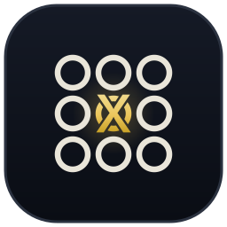

<p align="center"></p>

# 0x000000000.com 的页面代码 · 公开核对用

[English](README.md) · **中文**

[](https://github.com/0x000000000-com/0x000000000/actions/workflows/tamper-check.yml)
[](https://github.com/0x000000000-com/0x000000000/actions/workflows/noleak.yml)
[](https://github.com/0x000000000-com/0x000000000/actions/workflows/fonts.yml)

这个仓库只做一件事：**让你不用相信我们，自己就能确认两件事——**

1. **平台拿不到你的私钥。**
2. **平台没有偷偷改过页面。**

想先看动画版：**[0x000000000.com/ppt](https://0x000000000.com/ppt)** —— 6 步怎么走、为什么不用相信我们、为什么我们拿不到你的私钥、证据在哪。那一页的文件也在这里（`ppt.html`）。

## 先说原理（一段话）

你的钥匙分成两半：**你的那一半在你自己的浏览器里生成**，存成 `my-secret-s.json` 放在你自己的电脑上；平台只收到它的**公钥**（公开的，像银行卡号）和**签名**（证明你手里有那一半，但不暴露它）。平台用 GPU 铸出另一半 `b` 交给你，**合成完整私钥这一步也在你自己的浏览器里做**。从公钥推不出私钥——这是比特币、以太坊、TRON 整个体系的安全基础。

剩下唯一要相信的，是「合钥匙的那段网页代码没有偷偷把你那一半发出去」。这个仓库就是用来让你**核对这一点**的。

## 在哪里铸造：下载到你自己的电脑上

网站 0x000000000.com 上**只给下载，不做铸造**。铸造的 6 步只在你下载到电脑上的那一个文件（`0x000000000.html`）里出现：
双击打开，每一步都会用人话告诉你**这一步要断网还是要联网、为什么**。

| 步骤 | 断网 / 联网 | 为什么 |
|---|---|---|
| 1 造钥匙 | 🔌 建议断网 | 生成你的那一半钥匙。断网的时候，页面就算想往外发东西也发不出去 |
| 2 下单 | 🌐 要联网 | 平台要收到你要的图案、链、付款方式，才能建单、给收款地址 |
| 3 付款 | 🌐 要联网 | 你从交易所或钱包转 USDT；页面要连着网才看得到钱到没到 |
| 4 铸造 | 🌐 保持联网 | 平台的显卡在替你算，页面每隔几秒问一次进度 |
| 5 取货 → 合成 | 🌐 取货 → 🔌 合成可以断网 | 先联网把另一半取回来，再断网合成完整私钥、导出钱包文件 —— 完整私钥第一次出现的那一刻，你的电脑不连网 |
| 6 交收条 | 🌐 要联网 | 把「我拿到了」的签名交给平台，这一单才算结清（可以不交） |

同一个文件、同一个指纹：在网站上打开只显示「下载」，下载到电脑上双击打开才显示 6 步 —— 下面的检查两种打开方式都会验。

## 四样证据

| | 是什么 | 在哪看 |
|---|---|---|
| **① 页面就是这一个文件** | 网站首页 = 这里的 `0x000000000.html` = 网站上「下载铸造页面」得到的文件，**逐字节相同**。说明书 `0x000000000.com/ppt` = 这里的 `ppt.html`。两个指纹都写在 `SHA256SUMS`。每改一次都会在这里留下一条公开记录，删不掉。 | 本页 · 提交历史 |
| **② 防篡改巡检** | GitHub 的机器**每小时**到网站下载一次首页、下载版和说明书 `/ppt`，跟这里的指纹比。**不一致就变红**，谁都看得见。这个检查在 GitHub 上跑，平台插不上手。 | 上面第 1 个徽章 |
| **③ 私钥外发检查** | 每个新版本，GitHub 的机器用**真浏览器**把 6 步走完，把页面发出去的**每一个请求**逐个核对（见下表）：每个字段都要跟重算出来的值逐字相等，**多夹带一个字段、一个字符都会变红**。 | 上面第 2 个徽章 |
| **④ 字体可复现** | 页面里内嵌了两套开源字体（下面「字体」一节）。GitHub 的机器用字体官方的原始文件重新裁一遍，必须跟页面里那一份**逐字节相同** —— 那一大段字体数据里只有字体，没有夹带别的东西。 | 上面第 3 个徽章 |

## 页面发给平台的，全部在这里

| 什么时候 | 发了什么 | 怎么核对 |
|---|---|---|
| 打开页面 | 读价目表、看平台在不在线 —— **什么都没发** | 不许带任何内容 |
| 下单 | 哪条链、图案、用哪条链付款 | 字段正好这四个，值等于你选的 |
| 上传 | 公钥 A + 一个签名 | A 必须等于「你那一半 × G」；签名必须是 RFC6979 **确定性签名**（随机数那一格没有空间藏东西） |
| 等付款、等铸造 | 查订单进度、要收款地址 —— **什么都没发** | 不许带任何内容 |
| 取货 | 一个签名（证明是你本人来取） | 同上，确定性签名 |
| 交收条 | 用合出来的完整钥匙签的一个签名 | 确定性签名，平台没有你那一半，造不出这个签名 |

除此之外**不连任何别的地方**。检查里还会真的断网去点：「造钥匙」断网照样做完、期间 0 个请求；取货之后断网，「合成我的钥匙」「导出钱包文件」照样做完、期间 0 个请求。
另外几条：把这个文件当成网站打开，只能看到「下载」、看不到 6 步；下载到电脑上一开始就断网打开，TRON 和 EVM 两条链都能选、都能造钥匙 —— 网断着、浏览器却以为还连着（请求发出去一直没回音）也一样，一打开就能选，不等请求；没选过语言时是英文，切成中文以后已经造好的钥匙还在。检查代码就在 `test/noleak.cjs`，谁都可以自己跑。

## 钱包文件（第 5 步导出的那个）

- 第 5 步只导出一种东西：**钱包文件**（行业通用的 keystore V3 格式），用你**输两遍**的密码加密。页面不再导出明文私钥。
- **打开这个文件不需要密码**：里面的私钥是**加密过的**（`crypto` 那一段），地址本来就是公开的。**导入钱包的时候**才要输密码 —— 钱包用你的密码把私钥解出来。
- **TRON**：文件名是 `my-keystore.txt`，地址写成 `41` 开头的 42 位十六进制，这是 TronLink 认的写法（写成 T 开头，TronLink 导入时会卡住、也不报错）。导入：TronLink → 导入钱包 → Keystore → 选这个文件 → 输密码。
- **EVM**（以太坊、BSC 等）：文件名是 `my-keystore.json`。导入：MetaMask → 添加账户 → 导入账户 → 类型选「JSON 文件」→ 选这个文件 → 输密码。
- 私钥外发检查会用同一个密码把钱包文件解开，核对解出来的就是合成出来的那把钥匙、地址写法也对。

## 字体

页面全部用「代码风」字体：英文、数字、符号用 **JetBrains Mono**；中文用 **Noto Sans SC**，每个汉字改成正好两个英文字符宽，中英文落在同一张格子上。两套都是开源字体（SIL OFL 1.1）。

为了断网打开也是这套字、也不连任何字体网站，字体直接内嵌在页面里，只留页面上用得到的字（清单在 `src/css/fonts-chars.txt`）。`src/build-fonts.py` 用 Google Fonts 官方仓库的原始字体文件（网址钉在固定的提交上，指纹写在脚本开头）重新生成 `src/css/fonts.css`，任何人跑都逐字节相同。

## 自己核对（任选一种）

**核对你下载的文件**

```
Windows：  certutil -hashfile 0x000000000.html SHA256
Mac/Linux：shasum -a 256 0x000000000.html
```

得到的指纹要跟 `SHA256SUMS` 里的一样。

**核对网站现在跑的那一份**

```
curl -s https://0x000000000.com/ | shasum -a 256
curl -s https://0x000000000.com/ppt | shasum -a 256
```

第一行要等于 `SHA256SUMS` 里 `0x000000000.html` 那一行，第二行要等于 `ppt.html` 那一行。

**从源码自己构建一遍**（`src/` 里是页面的全部源码）

```
node src/build-single.mjs src rebuilt.html
```

构建出来的 `rebuilt.html` 必须跟 `0x000000000.html` 逐字节相同，任何人跑都一样。

**重新生成字体**（Python 3.11，先 `pip install fonttools==4.62.1 brotli==1.2.0`）

```
python src/build-fonts.py JetBrainsMono[wght].ttf NotoSansSC[wght].ttf
```

两个字体文件从 `src/build-fonts.py` 开头写的网址下载。生成的 `src/css/fonts.css` 必须跟仓库里的逐字节相同。

**断网测试**：把 `0x000000000.html` 下载到自己电脑上双击打开，关掉 Wi-Fi，再点「造钥匙」—— 照样能做完。第 5 步取货之后再关 Wi-Fi，「合成我的钥匙」「导出钱包文件」也照样能做完。

## 这里没有什么

平台的服务器代码、GPU 铸造程序不在这里。它们**碰不到你那一半**：它们收到的是什么，上面那张表已经逐字核对过了，跟服务器是真是假无关。所以检查里用的是一个公开的模拟平台（`test/mock-platform.mjs`）。

## 版本

每一次提交就是一个版本。页面上印着「页面版本」，是源码内容算出来的编号，跟这里 `src/` 的内容一一对应。

提交说明一律用中文。2026-09-24 有 4 次提交的说明只写了英文，这里补上中文（提交记录本身改不了 —— 这正是它可信的原因）：

| 提交 | 中文说明 |
|---|---|
| `7aa9992` | 页面脚本 `src/js/app.js`：第 4 步加上一直在动的「正在铸造」那一行；「我的订单」跟着订单状态变；英文界面付款方式下面那行改成英文（1/4，中间状态，不跑检查） |
| `9036d0b` | 页面样式 `src/css/style.css`：第 4 步那一行的样式（2/4，中间状态，不跑检查） |
| `9b1d7f6` | 私钥外发检查 `test/noleak.cjs` + `test/fixtures.json`：加「第 4 步」一段，和「下载版断网打开、后来联网」整页跟一直在线那份逐项对照（3/4，中间状态，不跑检查） |
| `7acb2b5` | 发布新版页面 `0x000000000.html` sha256 `61d68ffa…`（页面版本 `5c22b313d00c`）+ `SHA256SUMS`：第 4 步显示正在铸造（4/4） |
